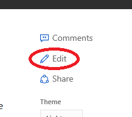
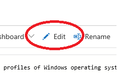
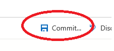
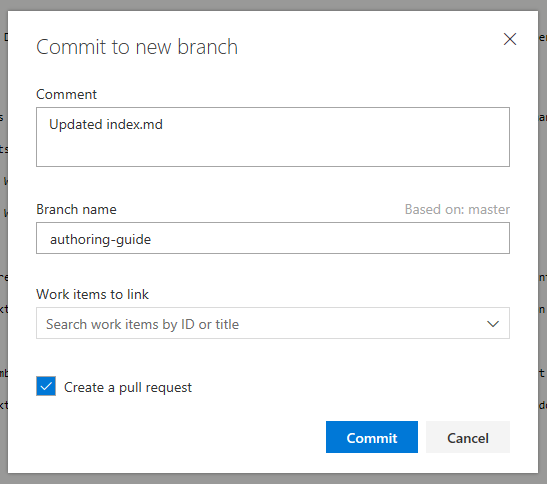
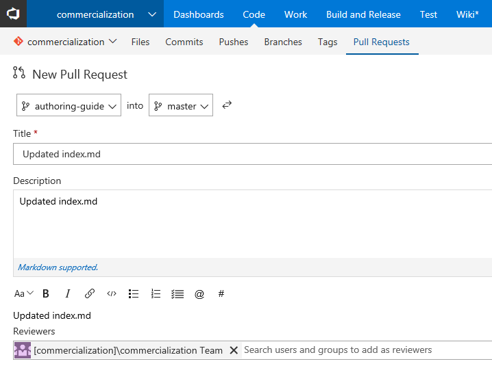

# Contribute to our private repository via the web interface
1. Find your topic on our review (staging) site. Prepend any docs URL with "review." to see the staging version:
  - Example:
    - Live URL: [https://docs.microsoft.com/windows-hardware/test/wpt/index](https://docs.microsoft.com/windows-hardware/test/wpt/index)
    - Staged URL: [https://review.docs.microsoft.com/windows-hardware/test/wpt/index](https://review.docs.microsoft.com/windows-hardware/test/wpt/index)

2. In the top-right corner, click the Edit button

    
3. The Edit button takes you to the VSO web interface specific to that page. To Edit the topic, click on the Edit/pencil icon on the right

    
4. Make your edits.

5. When you're finished with your edits, click on the Commit icon in the top-right

    

6. The Commit dialog should appear:
  - Provide a meaningful comment that describes your changes
  - You'll need to provide a separate branch name, as permissions to master are restricted
  - If the content is ready to be published, be sure to check **Create a pull request**, and click **Commit**
  
    > [!NOTE]
    > If the content is **not** ready to be published, leave the **Create a pull request** checkbox unchecked, and simply click **Commit**. Work with the corresponding content owner to determine when and how to publish the content.

    

7. For publish-ready content, after clicking **Commit**, you're taken to the **New Pull Request** page. Verify the request title and description, along with your file changes, and click **Create**. Once you create the pull request, someone from the Commercialization team will review your change before merging and publishing.

    