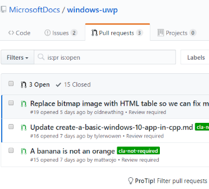
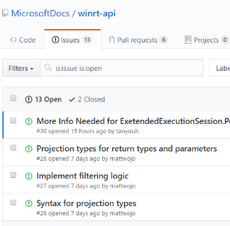
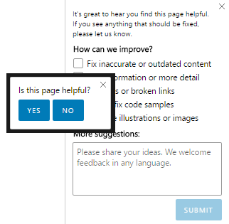

# CX expectations for responding to customers

Understanding customers is key to building great content and helping drive adoption and customer satisfaction. Content published on docs.microsoft.com enables members of the developer community to contribute Comments, CSAT/Verbatims, GitHub Issues, and GitHub PullRequests (PRs).
| GitHub PullRequests | GH Issues | LiveFyre Comments | CSAT/Verbatims |
| ------ | ------ | ------ | ------ |
|  |  |  |  |

CX has two levels of oversight for responding to these contributions, with the following responsibilities:
| CX Writers | CX Site Managers |
| ------ | ------
| Respond to relevant Livefyre comments on the pages you are assigned as author | Remove irrelevant or inappropriate comments or share a boilerplate response to off-topic comments |
| Take action on relevant verbatim feedback | Monitor CSAT (Customer Satisfaction) ratings |
| Respond in a timely way when assigned GH Issue or Pull Request to review and/or take action on... you will receive an email letting you know that you have been assigned an issue or PR to review | Track GitHub Issues and assign writers, technical v-team, or PM/Feature Teams, Merge PullRequests