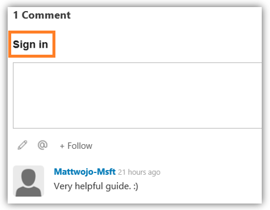
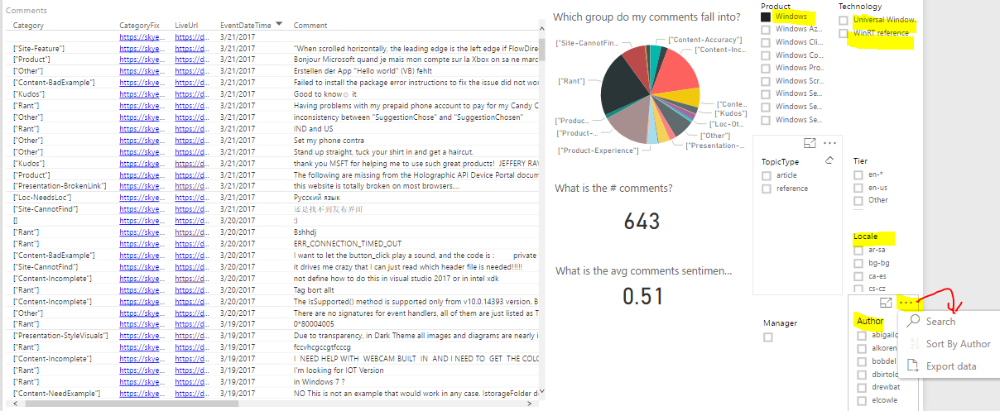

# Respond to customer comments

As a writer, you are responsible for responding to the comments on content that you own. Our target goal is to respond to comments within **5 business days** of receiving.

## How to respond to comments - Set up a Livefyre account
*You only need to do this step once.*

- Go to [https://idweb](https://idweb) and join the **skyeyepbi** security group. (If a group you already belong to is listed as a member of *skyeyebi*, you don't have to register individually.)
- Create a LiveFyre account by going to the comments section of a docs.microsoft.com page and clicking the "Sign-in" button. (E.g. [What's a UWP?](https://docs.microsoft.com/en-us/windows/uwp/get-started/whats-a-uwp) )

- When the sign-in page appears, click "Create New Account." When creating a User Name, please append "-msft" to the end of your username (ie. YourName-msft). Enter your Microsoft *work* email address (yourname@microsoft.com) and a password of your choice. Don't click the **Microsoft** button on the left -- this is for creating an account from a *Personal* email account.

- You should now be able to sign-in to Livefyre and respond to comments on your pages.
> [!Note]
> If you are having trouble signing up for a Livefyre account, try a different browser -- the Edge and Chrome browsers seem to work slightly differently with Livefyre.

## How to respond to comments - Use SkyEye to view the content you own

To find comments on articles you own, go to [http://aka.ms/skyeye/who](http://aka.ms/skyeye/who). *(Note that comments are not yet available for API reference content, but you can still view the other items in the list below.)* It is recommended that you check this tool at least once per week to:
- Respond to any unanswered Livefyre comments on your page *(see below for help with this)*
- Read any verbatim feedback that was left for your pages
- Check the CSAT (customer satisfaction) score on your pages
- See the month-by-month or week-by-week page traffic your pages are receiving
- Check whether there are any active Pull Requests  

**Sign up for email notifications:** Select **+Follow** at the bottom of your articles to receive a notice when a new comment is posted to the page. You may have to sign in. 

### What is the difference between Livefyre comments and Verbatims?
**Comments** are conversational, with a response in the form of a reply is expected. They show up for everyone to see on a docs page.

**Verbatims** are informational feedback, left anonymously, with a response in the form of determining whether the feedback is actionable (like a broken link, or clarifying something that is written in a confusing way on the doc), or may be just something to ponder (or ignore). They do not require any sort of reply. They are submitted with the Feedback tool in the bottom right of the page and are not visible to the public.

## Expectations and tips for responding to Livefyre comments
Community members can add LiveFyre comments in two ways: **Endnotes** (entered at the bottom of the page) and [**Sidenotes**](#sidenotes) (entered on the side of the document next to each paragraph). As a page owner, it is your responsibility to respond to these comments. The recommended goal is to respond to a comment within **5 business days** of receiving it -- this may be a simple acknowledgment of the comment, possibly with a promise to follow up after investigating a question. 

> [!NOTE]
> If a comment on your page is inappropriate or nonsense, please email WDG Site Management to have it removed--[Matt W](mailto:mattwoj@microsoft.com) and [Gina P](mailto:v-ginai@microsoft.com) are set up with permissions for removing comments.
> In addition, if you post or respond to a comment and notice that your livefyre comment is marked as "pending," it could be that your comment contains something that the built-in livefyre filters are concerned with. (LF filters for curse words, non-allowed code, etc). Just email one of the moderators listed above and they will approve your "pending" comment.

Here are some tips and example responses:

- Engage. Our hope is for authentic communication with our developer audience. Please reply to any questions posed. (It's up to you whether you want to reply to praise as well). Acknowledge that you are a Microsoft employee when replying (this should be taken care of with the -MSFT appended to your username) and that you are thankful for their input. 

>"@CommentorUserName Thanks for your comment. I will find an answer to your question and get back to you."

- Focus on the positive where possible. 

>“That’s not supported, but have you tried X?” 

- If the comment is about something that is wrong in the content, thank them for pointing out the issue and let them know that you will investigate and seek to fix it ASAP. 

- If the comment is a bug or suggested improvement to a product/service with a public repo, point the customer to where they can log an issue for the feature team to address.   

>"Thanks for the suggestion! Would you consider posting the issue here for the product team to track publically? E.g. [GitHub Issues for UWP Community Toolkit](https://github.com/Microsoft/UWPCommunityToolkit/issues), [GH Issues for UWP Customer Order Database Code Sample](https://github.com/Microsoft/Windows-appsample-customers-orders-database/issues), [Edge Issue Tracker](https://developer.microsoft.com/microsoft-edge/platform/issues/)""

- If the comment is regarding a bug or suggestion for a product/service with no public issue tracking, consider contacting the product team yourself and letting the customer know that you have passed their request along. *(If the bug is within WDG, use the WDG Content Request Tool, [http://aka.ms/pubrequest](http://aka.ms/pubrequest).)*

- If the comment is something that the customer can’t get to work, direct the user to where they can request direct support for their specific issue.

> "I'm sorry you're having trouble @CustomerName. That shouldn't be happening, but it's hard to tell what your particular issue is without more details. Please open a support incident at [https://aka.ms/storesupport](https://aka.ms/storesupport) and we should be able to get this resolved."
>A few more areas to consider sending customers for direct support: [Coding support for writing UWP apps](https://developer.microsoft.com/en-us/windows/support/uwp-coding-help), or [Submit a Dev Center Dashboard Issue](https://support.microsoft.com/en-us/getsupport?tenant=store&oaspworkflow=start_1.0.0.0&locale=en-us&supportregion=en-us&pesid=16070&supporttopic_L1=32530383&supporttopic_L2=32530384&ccsid=636245150294201004).

- If looking for info in the wrong place, direct the user to the correct location AND include a link to the topic. 

- If the comment is a question that you don't know the answer to, acknowledge the comment and let them know that you will look in to it, try checking with the PM or Feature Team, and respond with what you learn. 

>"Thanks for your question @CustomerName I don’t have a firm answer right now as to whether the advertising APIs in the Microsoft Store Services SDK are supported in Hosted Web Apps, but will check with the engineering team for a clarification. I'll post an update once I have something definitive."

- If the comment is an opinion and you disagree, thank them for their input and politely point out the alternative viewpoint. 

> "@CustomerName we appreciate your response. UWP is a powerful and flexible platform, and it allows you to target one form factor or various form factors. This decision is up to you."

- If the comment suggests something that is not supported, include that information in your response. 

>“Thanks for the suggestion, but this is not a supported scenario.” 

- If you receive a question or request from an internal member of Microsoft, please email WDG Site Management to have it removed--[Matt W](mailto:mattwoj@microsoft.com) and [Gina P](mailto:v-ginai@microsoft.com) are set up with permissions for removing comments. Contact the internal Microsoft employee and let them know that these comments are intended for public input and that they can either communicate with you directly via email or file a request using the WDG Content Request Tool, [http://aka.ms/pubrequest](http://aka.ms/pubrequest).

- **Including hyperlinked text in your comment**: So far, the only way that I have found to successfully include [hyperlinked text](#) in a LiveFyre comment or response is to create the hyperlinked text in a Word doc, then copy and paste it in. Non-hyper links, ie. [http://www.link.com](#), should automatically go live when your comment is posted.

### Sidenotes
You may have "Sidenotes", also known as "inline comments" on your page, indicated by a very small number in the right margin next to the page content. 

Sidenotes are typically about a very specific line of the content, as opposed to the content as a whole. In the example below, the content referred to an image of an orange, calling it a banana. The public called this out, we noticed and corrected the issue. This is a great example of a sidenote aiding us in the correction of a silly mistake. (Email Site Management to later remove the sidenote after the correction is made as it would not make sense nor add any value following the correction).

For questions or additional guidance on how to appropriately respond to a comment not covered by these examples, email [WDG Channel Managers](mailto:wdgdevsm@microsoft.com) or refer to the [OPS Guidance](https://review.docs.microsoft.com/en-us/help/contribute/contribute-how-to-manage-act-guidelines-livefyre).

## See also
- [How to review and accept pull requests](review-pull-requests.md)
- [OPS guidelines for responding to public pull requests](https://review.docs.microsoft.com/en-us/help/contribute/contribute-how-to-manage-act-guidelines-public-pr)
- [OPS best practices for fixing actionable verbatims](https://review.docs.microsoft.com/en-us/help/contribute/contribute-how-to-manage-act-bp-actionable-verbatims)

## Finding data for your content using SkyEye Analytics HUB
You can access the [**SkyEye Analytics Hub**](http://skyeyereports.cloudapp.net/home) to find a variety of interactive data reports. Specifically the "Topics(OnPrem)" tool is helpful for searching through ALL of the comments posted on our docs.ms content. You can search by your author name to view every comment that has ever been written on any page in which you are listed as the owner. 

### Find the verbatims for your page content
To find a list of all of the verbatims left on content you own, go to [http://aka.ms/docsverbatims](http://aka.ms/docsverbatims).
- You can select "Windows" (or "Microsoft Edge") from the "Product" menu, choose UWP or API Ref as the "Technology", choose to look at a specific local (for example, selecting "en-us" will show only English page comments, "fr-fr" only French page comments).
- You can search by your author name as well -- look through the list or click the ... to open the search tool.

### Find the comments for your page content
To find comments on articles you own, go to [http://aka.ms/skyeye/who](http://aka.ms/skyeye/who). *(Note that comments are not yet available for API reference content, but you can still view the other items in the list below.)*

### Find the comments for all Windows content
To view a list of all comments left on ALL of the Windows content, go to [http://aka.ms/docscomments](http://aka.ms/docscomments).
- Select the content set you want to view from the "ProductService" dropdown list, or select the "..." in the top right to use the search tool. For example, you can search for "Windows" or for "Microsoft Edge", however, search does not get any further specific than those high levels for this tool.

---------------
## Admin Only
- **Power BI page**: [http://aka.ms/skyeye/livefyre](http://aka.ms/skyeye/livefyre) To view all of the Livefyre comments made on our content in one place, 
- **Skyeye search page**: [http://aka.ms/skyeye/search](http://aka.ms/skyeye/search) To search what content an individual writer has assigned. *Can also use [http://aka.ms/skyeye/who](http://aka.ms/skyeye/who). 
- **Livefyre Studio**: [http://aka.ms/skyeye/livefyre/studio](http://aka.ms/skyeye/livefyre/studio) To remove comments if necessary -- must sign-up for admin permission by emailing [C&E APEX Skyeye team](mailto:skyeye@microsoft.com). *[Gigel Avram](mailto:Gigel.Avram@microsoft.com) has been a point person. For safety's sake, only a few people on each team will have permissions to Livefyre Studio.
- **OPS Skyeye Documention**: [https://review.docs.microsoft.com/en-us/help/contribute](https://review.docs.microsoft.com/en-us/help/contribute/contribute-how-to-manage-data)