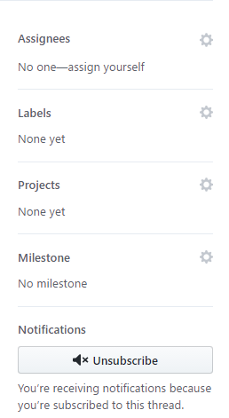

# # Respond to customer issues and internal issues

## Respond to an issue filed by internal team members *(PMs, Feature Teams, etc)*

To file an issue internally, whether it is a bug, request for new content or request that a writer update existing content, it is recommended to use the WDG Content Request Tool at [http://aka.ms/pubrequest](http://aka.ms/pubrequest).

When an internal partner files an issue using this Content Request Tool, they receive an email confirming that the request has been filed from *Intl WHH Service Account* with a link to the TFS work item to monitor progress.

The CX channel management team monitors these requests and assigns the TFS item to the appropriate content owner. As a content owner, it is then your responsibility to follow up with the request -- 1) Let the internal employee who filed the request know that you will be looking in to it; 2) For minor requests, resolve the issue and reassign it to the employee who opened it so they can confirm and close it. For larger requests, check in with your lead to ensure that dedicating resources to resolving the issue aligns with our priorities, link the issue to any appropriate higher-level deliverables, and include any additional team member resources necessary to resolve. *Remember to update the Due Date, Iteration Date, and add any relevant notes to the task in TFS.

## Respond to an issue filed by a customer

The public is invited to file issues via the [GitHub Issues](https://guides.github.com/features/issues/) section of each repo. These issues are monitored by the repo admin who will seek to find and assign the appropriate content owner, notifying that content owner via email.

Content owners should post a reply on the GitHub Issue **within 5 business days** of receiving this email notifying. The reply may simply state publicly that the issue is under investigation, or if the issue is easily resolved, a reply may explain a resolution of the issue and close it.

### Investigating an issue

When investigating a more complex issue, you may want to use one of the built-in tools:
- **Assignees**: Multiple team members can be assigned to resolving an issue
- **Labels**: It may be helpful to attach a label (or multiple) declaring whether the issue is a bug, a duplicate, help wanted, a question, invalid, or a won't fix. (Ignore the CLA agreement labels)
- **Projects**: If the issue is associated with a larger project, that can be labeled here.
- **Milestone**: If the issue is associated with a larger milestone, that can be labeled here.

Find both opened (currently active) and closed (resolved) issues by visiting the site repos:

- [UWP Conceptual Issues](https://github.com/MicrosoftDocs/windows-uwp/issues)
- [UWP API Reference Issues](https://github.com/MicrosoftDocs/winrt-api/issues)
- [Microsoft Edge Developer Docs Issues](https://github.com/MicrosoftDocs/edge-developer/issues)
- [Cortana Docs Issues](https://github.com/Microsoft/cortana-docs/issues)
- [WDG IT Pro Docs Issues](https://github.com/Microsoft/win-cpub-itpro-docs)