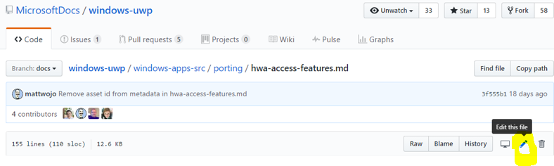

## Contributing to the public GitHub repo

> [!IMPORTANT]
> Microsoft employees must use the VSTS repo to contribute to the UWP docs. The information provided here is for providing to external customers who want to contribute.

You can contribute to the public UWP GitHub repo by following these instructions, but note that contributing via pull request on the public repo requires a full writer review, which takes up to 6 business days, then up to an additional 2 business days once the review is approved to be merged and published to the live site. For internal writers, PMs, and Feature Team contributors, it is recommended to [contribute directly to the VSGit repo](setup-local-repo-for-large-changes.md) as your updates will be published live in a much quicker turn-around time.

### How to contribute to the public GitHub repo
 1) Go to the staging server for the article:
`https://review.docs.microsoft.com/en-us/windows/uwp/<article path>?<branch>`
For example, [https://review.docs.microsoft.com/en-us/windows/uwp/layout/index?branch=master](https://review.docs.microsoft.com/en-us/windows/uwp/layout/index?branch=master)

2) Click the **Edit** button.
- The edit button takes you to the web interface for the **windows uwp repo**:
[https://github.com/MicrosoftDocs/windows-uwp/blob/docs/windows-apps-src/layout/index.md](https://github.com/MicrosoftDocs/windows-uwp/blob/docs/windows-apps-src/layout/index.md)

3) Edit right in the browser by clicking the pen (edit) icon and making changes in GitHub's built-in text editor.

4) After your edits have been made, write a title and description for the changes you have made, then click the "Commit changes" button. This will open a new pull request.

5) In this new pull request, be sure that the "base:" you are requesting to merge with is set to "docs". You can also select any specific reviewers you would like to take a look at your updates. Once you have done this, click the "Create pull request" button. Once your pull request has been reviewed and signed off on, it will automatically be published to the live site. This may take up to 8 business days.