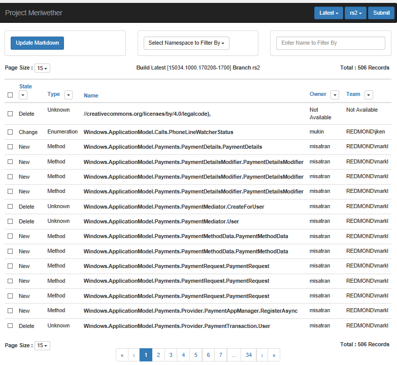

# Adding, removing, updating, and holding back APIs
<link rel="stylesheet" href="https://az835927.vo.msecnd.net/sites/uwp/Resources/css/custom.css">

Unlike conceptual articles, you don't create or delete WinRT markdown files yourself. You use the  [Diff tool](http://meriwether) to add or remove APIs for you.

<figure>
  
  <figcaption class="uwpd">The diff tool</figcaption>
</figure>

## Who's responsible for diffing?
In general, the cpub writer assigned to the namespace should do the diffing.

## How does it work?
The diff tool compares the API surface from a Windows build with the authored content in the specified branch. By default, the tool compares the latest RS2 build with the authored content in the **[rs2](https://cpubwin.visualstudio.com/windows-uwp/_git/winrt-api/?branch=rs2)** branch.

By default, the page opens comparing the API surface from the latest RS2 build (left) with authored content in the **Develop** branch (right). The left and right sides of the diff can be changed using the dropdown lists in the upper-right of the page heading. After changing the left and/or right of the diff directive, click the **Submit** button to refresh the page.

## What branch do I diff in?
Please diff directly into the **[rs2](https://cpubwin.visualstudio.com/windows-uwp/_git/winrt-api/?branch=rs2)** branch, then [create a personal branch](making-and-reviewing-changes.md) off **rs2** to author/update descriptions inside the markdown files.

## Adding new APIs
If a new class is added to the API surface, you will see a diff entry for the class itself, plus a diff entry for every member in the class. To acknowledge this new APIs, click the checkbox for the APIs then click **Update Markdown** in the upper-left of the page heading. This will generate stub markdown files for all the selected APIs.

> [!NOTE]
> **Currently, this process can take up to 2 hours.**

After the system is done processing, it will create markdown files for your new APIs to the selected branch of the **winrt-api** repo. You can then go to the content repo to write descriptions in the new markdown files. There will be a markdown file for the class and each of its members.

## Deleting APIs
The diff report does now allow any action to be taken on markdown files associated with deleted APIs. You are responsible for manually deleting the markdown file from the authoring repo.

## Changed APIs
If a method signature changes, the diff report will list this as a delete and a new. The **Update Markdown** action will stub out a new markdown file for the added API. Content from the old content file will still exist so you can copy content into the new file. You can then manually delete the old member markdown file from the repo.

If a method signature doesn't change but a parameter name changes, the diff report will list this as a change. The **Update Markdown** action will update the existing markdown file for the member to reflect the parameter name change.

## API Holdbacks
If you have an API that is present in the build but should not be documented, for whatever reason, simply do not acknowledge the new API from the Diff Report into the **Develop** branch. You can ACK it into a private branch if you want to write documentation, but as long as a markdown file for an API entity does not exist, the API will not show up in the build output.

**Next: [Making and reviewing changes](making-and-reviewing-changes.md)**