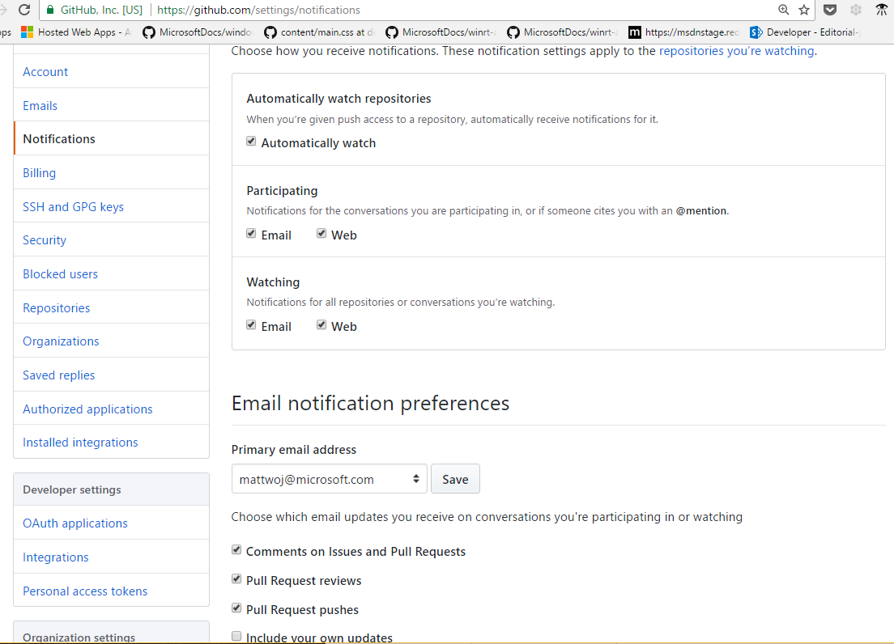

# Email notification settings for GitHub and VSTS

You can adjust how you receive email in the [Notifications tab](https://github.com/settings/notifications) of your personal GitHub account settings.

This includes whether or not to automatically receive watch notifications, @mention notifications from conversation threads, Issue comments or Pull Request reviews, or Pull Request pushes.

General guidance is to leave these settings in their default state, but depending on the circumstance, you may want to make adjustments. You can also change your Primary email address setting here.

## VSO repo notifications must be set by the repo administrator

